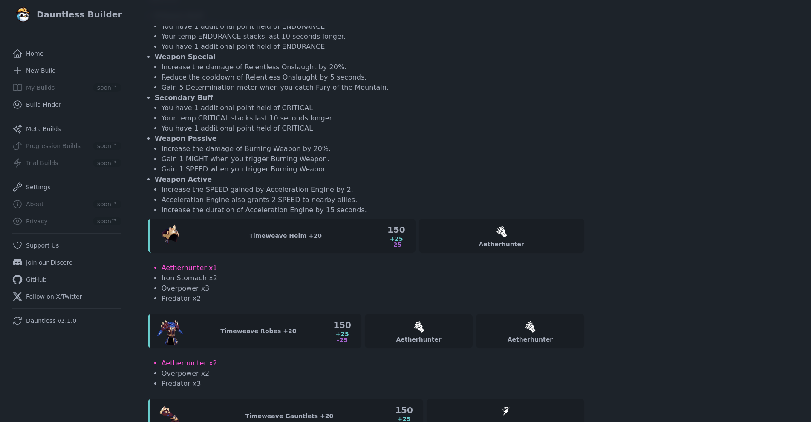

# dauntless-builder

Create and share Dauntless builds with your friends!

See also: [phalanx](https://github.com/atomicptr/phalanx)



## Setup

```bash
# Clone the repository
$ git clone https://github.com/atomicptr/dauntless-builder.git
$ cd dauntless-builder

# Install dependencies
$ npm install

# Setup .env
$ cp .env.example .env

# Run application
$ npm run dev
```

Dauntless Builder should now run at: http://localhost:5173

## Data Access

The data used by Dauntless Builder is available via endpoints like /api/data.json and /api/builds.json

See:

- [PHP Dauntless Builder SDK](https://github.com/atomicptr/php-dauntless-builder-sdk)

for how to access the data properly

## Assets

All Dauntless related assets are the property of Phoenix Labs.

## License

[](<https://tldrlegal.com/license/gnu-affero-general-public-license-v3-(agpl-3.0)>)
